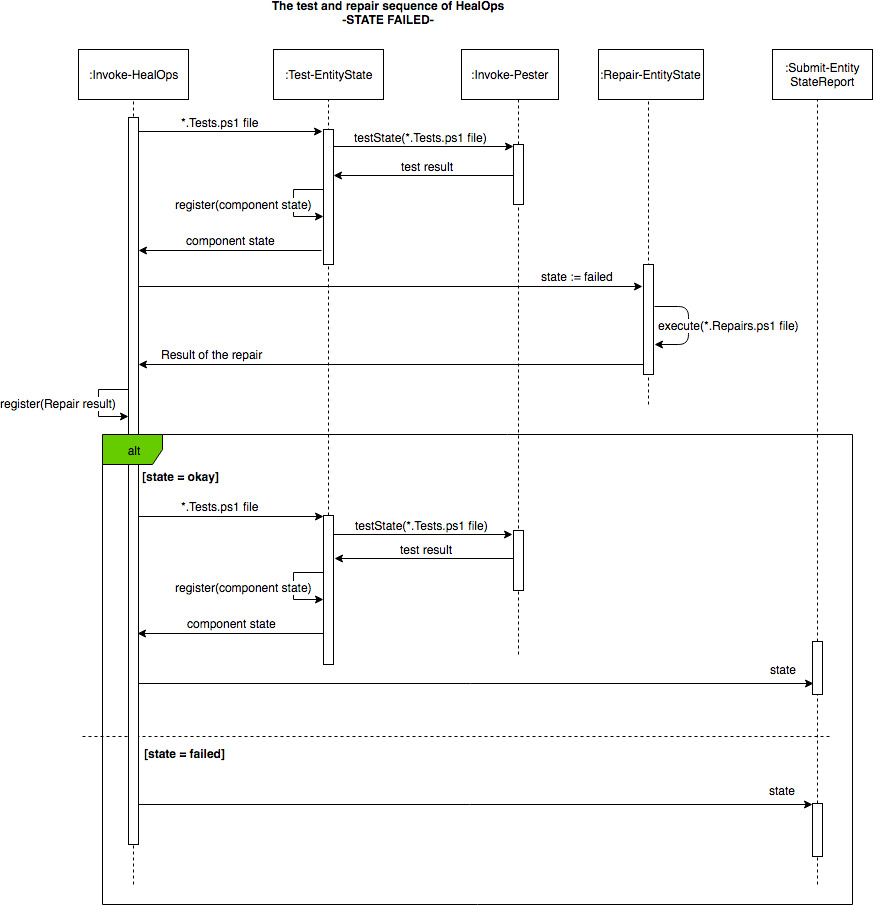
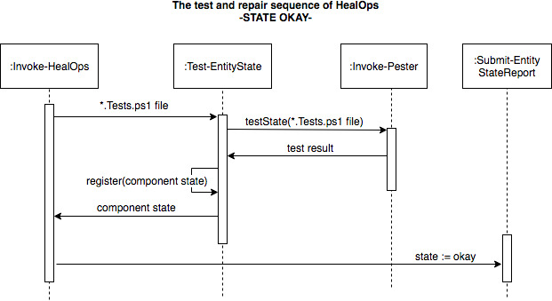

# An architectural overview of HealOps

This page is not for the faint of heart. However, if you do hold out, you will gain invaluable knowledge on how HealOps works. Especially useful when developing HealOpsPackages and certainly required reading if contributing to HealOps itself.

## The components of HealOps

## Diagrams

### The state engine of HealOps

A picture or words? PICTURE!

> A sequence diagram illustrating the case of a component in a failed state.

> A sequence diagram illustrating the case of a component in an okay state

